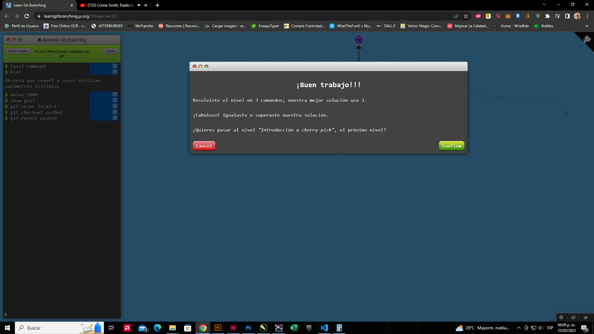
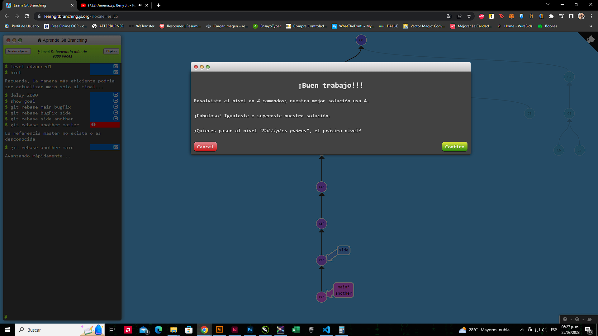
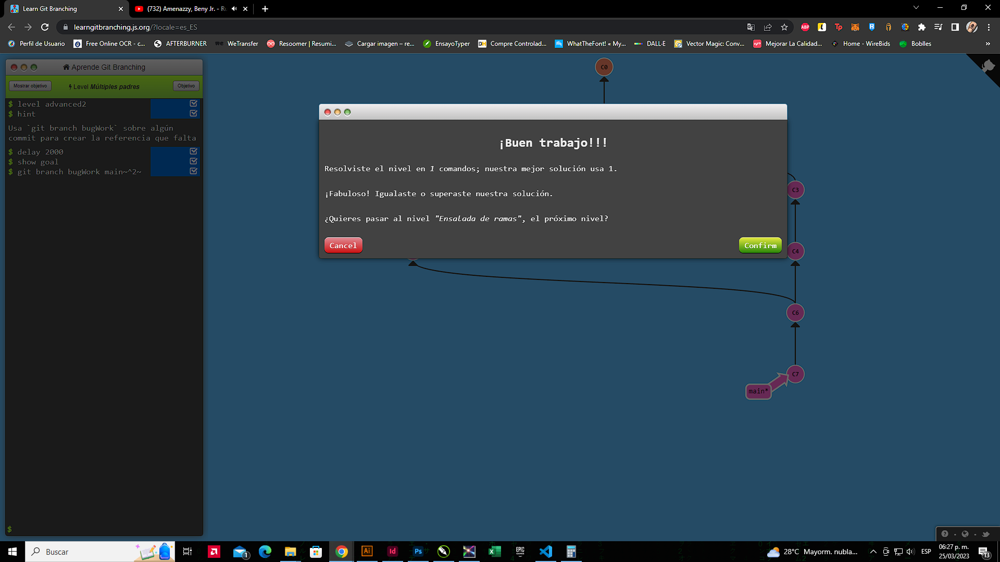
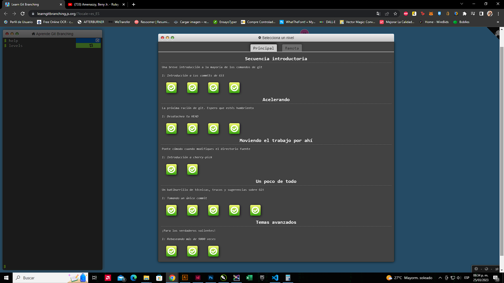
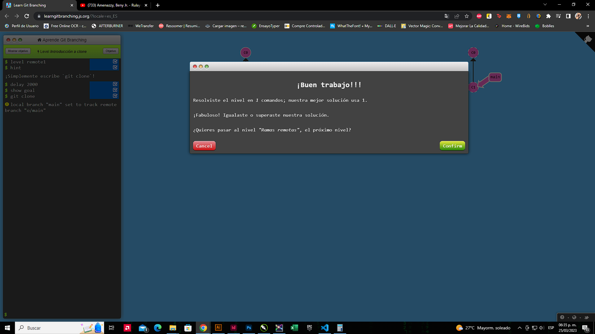
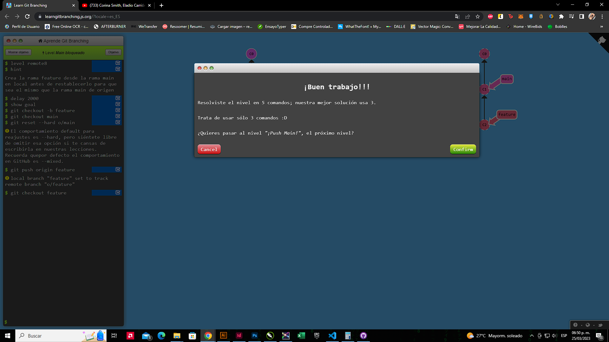
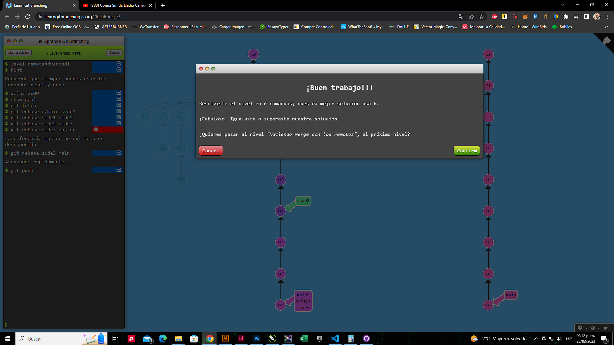
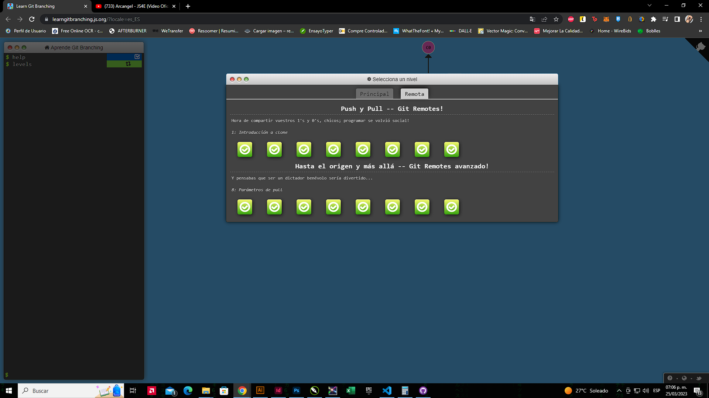

# SP-repositorio
Complete con exito el juego Lear Git Branching

# FELIX JOSUE LOPEZ LOPEZ 2021-0116

# PRINCIPAL

## 1.1 Introduction to Git Commits

### git commit
### git commit

## 1.2 Branching in Git

### git branch bugFix
### git checkout bugFix

## 1.3 Merging in Git

### git checkout -b bugFix
### git commit
### git checkout main
### git commit
### git merge bugFix

## 1.4 Rebase Introduction

### git checkout -b bugFix
### git commit
### git checkout main
### git commit
### git checkout bugFix
### git rebase main

## 2.1 Detach yo’ HEAD

### git checkout C4

## 2.2 Relative refs (^)

### git checkout C4^

## 2.3 Relative refs #2

### git branch -f main C6
### git branch -f bugFix C0
### git checkout C1

## 2.4 Reversing Changes in Git

### git reset local~1
### git checkout pushed
### git revert pushed

## 3.1 Cherry-pick Intro

### git cherry-pick C3 C4 C7

## 3.2 Interactive Rebase Intro

### git rebase -i main~4 --aboveAll
#### Ordené las commit en C3, C5, C4, luego omiti la C2.

## 4.1 Grabbing Just 1 Commit

### git checkout main
### git cherry-pick C4

# 4.2 Juggling Commits

### git rebase -i caption~2 --aboveAll
#### Aqui ordene C3, C2.
### git commit --amend;
### git rebase -i caption~2 --aboveAll
#### Aqui ordene C2, C3.
### git branch -f main caption

# 4.3 Juggling Commits #2

### git checkout main
### git cherry-pick C2
### git commit --amend
### git cherry-pick C3

# 4.4 Git Tags

### git tag v0 C1
### git tag v1 C2
### git checkout C2

# 4.5 Git Describe

### git commit

# 5.1 Rebasing over 9000 times

### git rebase main bugFix
### git rebase bugFix side
### git rebase side another
### git rebase another main

# 5.2 Multiple parents

### git branch bugWork main~^2~

# 5.3 Branch Spaghetti

### git checkout one
### git cherry-pick C4 C3 C2
### git checkout two
### git cherry-pick C5 C4 C3 C2
### git branch -f three C2

# REMOTA

# 1.1 Clone Intro

### git clone

# 1.2 Remote Branches

### git commit
### git checkout o/main
### git commit

# 1.3 Git Fetchin

### git fetch

# 1.4 Git Pullin

### git pull

# 1.5 Fakeing Teamwork

### git clone
### git fakeTeamwork main 2
### git commit
### git pull

# 1.6 Git Pushin

### git clone
### git commit
### git commit
### git push

# 1.7 Diverged History

### git clone
### git fakeTeamwork
### git commit
### git pull --rebase
### git push

# 1.8 Locked Main

### git checkout -b feature
### git checkout main
### git reset --hard o/main
### git push origin feature
### git checkout feature

# 2.1 Push Main!

### git fetch
### git rebase o/main side1
### git rebase side1 side2
### git rebase side2 side3
### git rebase side3 main
### git push

# 2.2 Mering with remotes

### git checkout main
### git pull
### git merge side1
### git merge side2
### git merge side3
### git push

# 2.3 Remoting Tracking

### git checkout -b side o/main
### git commit
### git pull --rebase
### git push

# 2.4 Git push arguments

### git push origin main
### git push origin foo

## 2.5 Git push arguments — Expanded!

### git push origin main~1:foo
### git push origin foo:main

## 2.6 Fetch arguments

### git fetch origin main~1:foo
### git fetch origin foo:main
### git checkout foo
### git merge main

## 2.7 Source of nothing

### git push origin :foo
### git fetch origin :bar

## 2.8 Pull arguments

### git pull origin bar:foo
### git pull origin main:side

